# Database Design & ERD

The schema is normalised PostgreSQL, managed by SQLAlchemy 2.0 (async) and
versioned with Alembic. All primary keys are 64-bit (`BIGINT` / `BIGSERIAL`)
to comfortably handle very large row counts. Hot-path counters use atomic SQL
updates; high-volume tables are append-only.

## Entity-Relationship Diagram

```mermaid
erDiagram
    users ||--|| user_stats : has
    users ||--o{ transactions : logs
    users ||--o{ reward_claims : claims
    users ||--o{ user_achievements : unlocks
    users ||--o{ inventory_items : owns
    users ||--o{ user_powerups : owns
    users ||--o{ case_openings : opens
    users ||--o| clan_members : "is member"
    users ||--o{ battle_participants : plays
    users ||--o{ lobby_members : joins
    users ||--o{ users : refers

    battles ||--o{ battle_participants : has
    battles }o--o| seasons : "counts toward"

    lobbies ||--o{ lobby_members : has
    lobbies }o--o| battles : "starts"

    clans ||--o{ clan_members : has
    clans ||--o{ clan_wars : "fights (A)"

    seasons ||--o{ season_participants : tracks
    seasons ||--o{ hall_of_fame : immortalizes

    users {
        bigint id PK
        bigint telegram_id UK
        string username
        bigint balance
        bigint xp
        string rank
        int current_streak
        int best_streak
        bigint referrer_id FK
        bool is_banned
        bool is_admin
        int suspicion_score
        timestamptz last_daily_at
        timestamptz last_weekly_at
        timestamptz last_chest_at
    }
    user_stats {
        bigint user_id PK,FK
        bigint total_games
        bigint wins
        bigint losses
        bigint draws
        bigint biggest_win
        bigint biggest_loss
        bigint total_wagered
        bigint coins_earned
        bigint coins_spent
        int tournaments_won
    }
    transactions {
        bigint id PK
        bigint user_id FK
        string type
        bigint amount
        bigint balance_after
        string reference
        timestamptz created_at
    }
    reward_claims {
        bigint id PK
        bigint user_id FK
        string reward_type
        bigint amount
        bigint streak_day
    }
    battles {
        bigint id PK
        string mode
        string status
        bigint stake
        bigint pot
        bigint house_cut
        bool is_team_mode
        bigint created_by_id FK
        bigint winner_id FK
        int winning_team
        bigint season_id FK
        bigint chat_id
        jsonb extra
    }
    battle_participants {
        bigint id PK
        bigint battle_id FK
        bigint user_id FK
        int team
        int score
        jsonb rolls
        bool is_winner
        bigint payout
        jsonb powerups_used
    }
    lobbies {
        bigint id PK
        string code UK
        string mode
        string status
        bigint host_id FK
        bigint stake
        int max_players
        bool is_private
        string password_hash
        bigint battle_id FK
        timestamptz expires_at
    }
    lobby_members {
        bigint id PK
        bigint lobby_id FK
        bigint user_id FK
        int team
        bool is_ready
    }
    clans {
        bigint id PK
        string name UK
        string tag UK
        bigint leader_id FK
        bigint treasury
        bigint total_points
        int wars_won
        int level
        int max_members
    }
    clan_members {
        bigint id PK
        bigint clan_id FK
        bigint user_id FK,UK
        string role
        bigint contributed
    }
    clan_wars {
        bigint id PK
        bigint clan_a_id FK
        bigint clan_b_id FK
        int clan_a_score
        int clan_b_score
        bigint prize_pool
        bigint winner_clan_id FK
        string status
    }
    seasons {
        bigint id PK
        string name
        int number UK
        bool is_active
        timestamptz ends_at
        timestamptz finalized_at
    }
    season_participants {
        bigint id PK
        bigint season_id FK
        bigint user_id FK
        bigint season_points
        int season_wins
        bigint season_coins
        int final_rank
    }
    hall_of_fame {
        bigint id PK
        bigint season_id FK
        bigint user_id FK
        int placement
        bigint season_points
        string badge_code
        bigint reward_coins
    }
    user_achievements {
        bigint id PK
        bigint user_id FK
        string code
        timestamptz unlocked_at
    }
    inventory_items {
        bigint id PK
        bigint user_id FK
        string kind
        string item_code
        int quantity
    }
    user_powerups {
        bigint id PK
        bigint user_id FK
        string type
        int charges
        timestamptz expires_at
    }
    case_openings {
        bigint id PK
        bigint user_id FK
        string case_code
        string rarity
        int price
        string reward_kind
        int reward_coins
    }
    admin_logs {
        bigint id PK
        bigint admin_id
        string action
        bigint target_user_id
        jsonb details
    }
    anti_cheat_logs {
        bigint id PK
        bigint user_id FK
        string rule
        bigint severity
        bool resolved
        jsonb meta
    }
```

## Tables (20)

| Table | Purpose |
|-------|---------|
| `users` | Core player record: identity, balance, XP/rank, streaks, referral, moderation |
| `user_stats` | 1:1 aggregate statistics, split out to reduce row contention |
| `transactions` | Append-only coin ledger (signed amount + balance snapshot) |
| `reward_claims` | Daily/weekly/chest claim history (streaks, idempotency) |
| `battles` | A battle instance in any mode; `extra` JSONB holds mode params |
| `battle_participants` | Per-player participation, dice rolls, payout |
| `lobbies` | Pre-battle gathering rooms; private lobbies store a password hash |
| `lobby_members` | Lobby membership |
| `clans` | Player clans with treasury & ranking |
| `clan_members` | Clan membership & role (one clan per user) |
| `clan_wars` | Head-to-head clan competitions |
| `seasons` | Monthly competitive seasons |
| `season_participants` | Per-season score (reset each season) |
| `hall_of_fame` | Permanent record of season winners |
| `user_achievements` | Unlocked achievements (catalogue lives in code) |
| `inventory_items` | Owned cosmetics (titles/frames/badges) |
| `user_powerups` | Owned powerups & charges |
| `case_openings` | Loot-case opening audit trail |
| `admin_logs` | Privileged admin action audit trail |
| `anti_cheat_logs` | Flagged suspicious activity |

## Index strategy

Indexes target the actual query patterns (leaderboards, ledgers, matchmaking):

- **Leaderboards**: `ix_users_balance_desc` (`balance DESC`), `ix_users_xp_desc`
  (`xp DESC`), `user_stats.wins`, `users.best_streak`, and
  `ix_season_participants_points` (`season_id, season_points DESC`).
- **Ledger & history**: `ix_transactions_user_created` (`user_id, created_at`),
  `ix_transactions_type_created`.
- **Matchmaking & group flow**: `ix_battles_mode_status`,
  `ix_battles_chat_status`, `ix_lobbies_status_private`, `ix_lobbies_mode_stake`.
- **Uniqueness**: `users.telegram_id`, `lobbies.code`, `clans.name`/`tag`,
  `clan_members.user_id`, and composite uniques for
  participants/members/achievements/powerups to prevent duplicates.

Constraint names follow a fixed naming convention (`pk_`, `ix_`, `uq_`, `fk_`,
`ck_`) so Alembic autogenerate produces stable, reviewable migrations.

## Integrity & concurrency notes

- Balance updates are atomic and guarded (`WHERE balance >= amount`), so coins
  can never go negative under concurrency.
- Matchmaking queries use `SELECT … FOR UPDATE SKIP LOCKED` to avoid two players
  grabbing the same open battle/lobby.
- Inventory & powerup grants use PostgreSQL `INSERT … ON CONFLICT DO UPDATE`
  (upsert) for idempotency.
- The ledger (`transactions`) is append-only and snapshots `balance_after` for
  auditability and dispute resolution.
